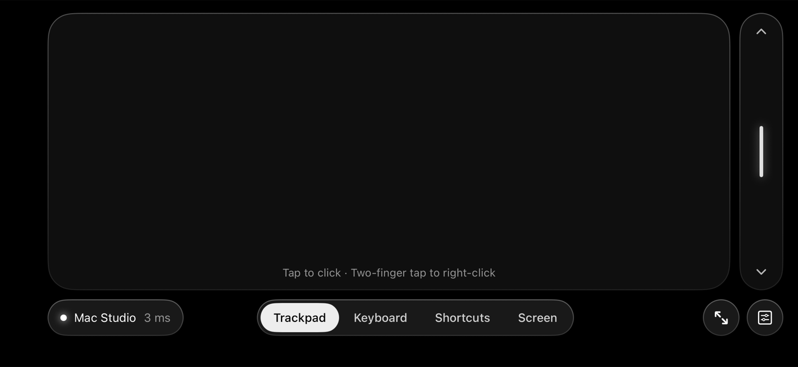
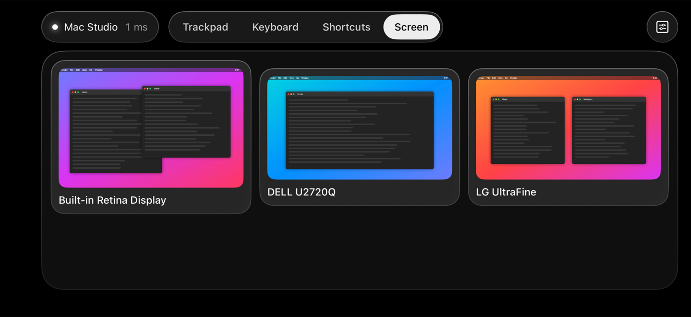
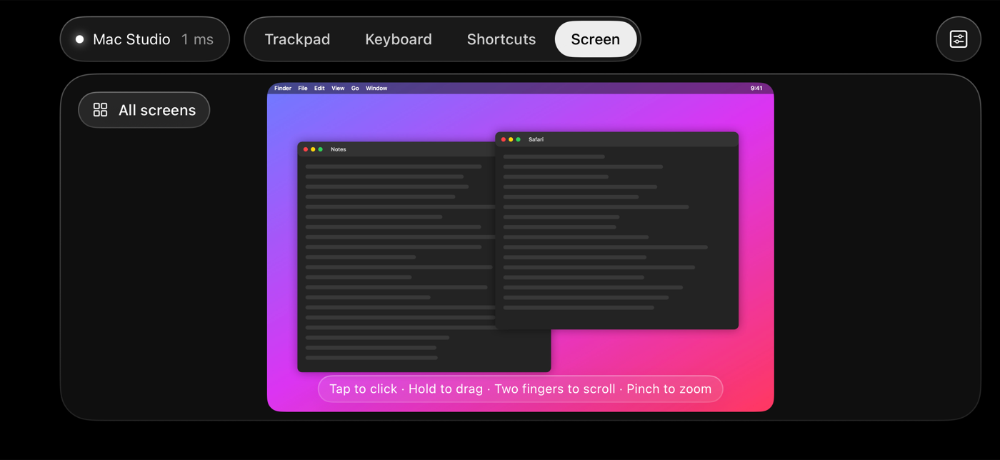
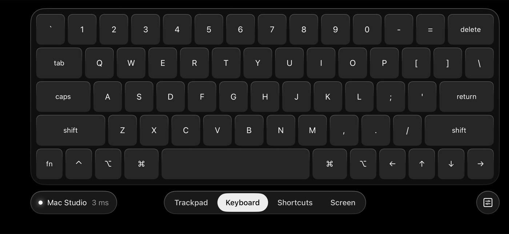
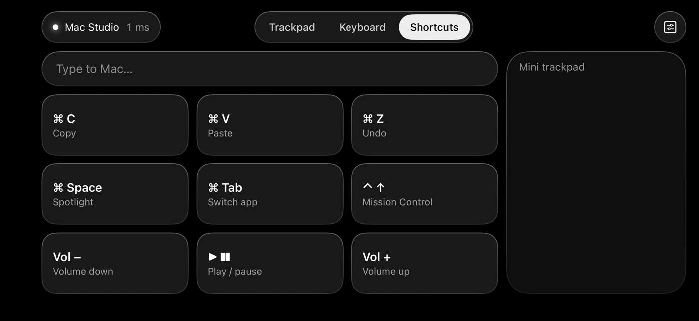
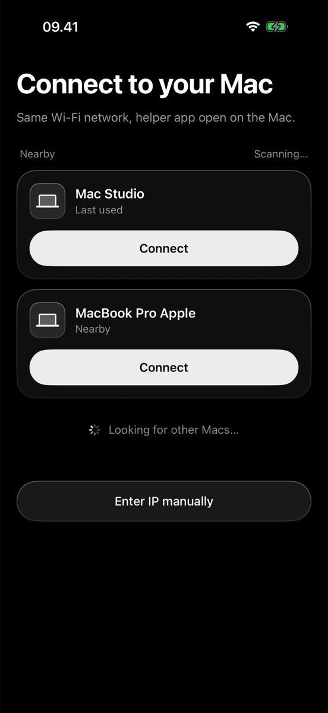
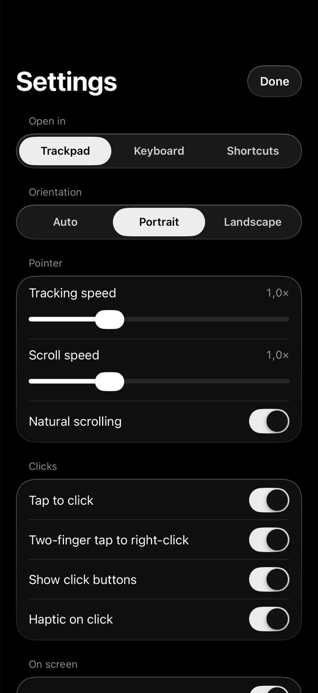
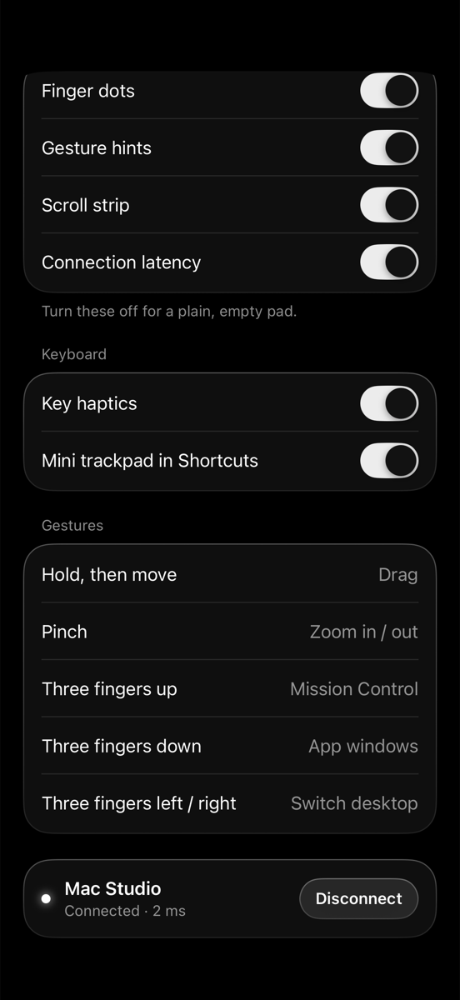

<p align="center">
  
</p>

# Touche

Turn your iPhone into a trackpad and keyboard for your Mac, over your local Wi-Fi.

Move the pointer, tap to click, scroll with two fingers, drag, pinch to zoom, swipe with three fingers for
Mission Control, type on a Mac keyboard, fire common shortcuts, or see your Mac's screen and tap to click on it,
all from your phone.

<p align="center">
  
</p>

## How it works

An iPhone can't pretend to be a Bluetooth trackpad (iOS doesn't let apps act as a Bluetooth input device),
so Touche comes in two parts:

```
iPhone app ──(local Wi-Fi, TLS)──▶ Mac helper (menu bar) ──(CGEvent)──▶ pointer, clicks, scroll, keys
reads your fingers                  turns messages into real input events
```

- **Discovery:** the Mac helper announces itself with Bonjour (`_digitalctl._tcp`), so the iPhone finds it
  with no IP typing. The pairing QR code also carries the Mac's IP (the helper listens on port `51515`), for
  networks that block Bonjour.
- **Pairing and encryption:** the helper makes a random 256-bit secret and shows it as a QR code
  (menu bar → *Pair iPhone…*). Scan it once with the app, or with the iPhone's Camera. The secret becomes a TLS
  pre-shared key, so all traffic is encrypted and a phone without the current secret fails the handshake. TLS
  session resumption is off, so every connection proves the secret, and *Reset pairing* shuts out every phone.
- **Protocol:** every iPhone → Mac message is 9 bytes (1-byte kind + two Float32 values), sent over TCP with
  Nagle off. Mac → iPhone messages (latency echoes, screen video, thumbnails) carry a 5-byte kind + length
  header; kinds the app doesn't know are skipped, so an older app keeps working with a newer helper.
  The traffic is marked as interactive so Wi-Fi power saving doesn't hold packets back.
- **Input on the Mac:** the helper posts `CGEvent`s. Scrolls are trackpad-style (continuous pixel deltas with
  scroll and momentum phases), so apps rubber-band and glide like they do with a real trackpad.

## Features

**Trackpad**

| Gesture | Does |
|---|---|
| One finger | Move the pointer (with acceleration) |
| Tap | Left click (tap twice quickly to double-click) |
| Two-finger tap | Right click |
| Hold, then move | Drag (the phone vibrates when it grabs) |
| Two fingers | Scroll, with momentum when you flick |
| Pinch | Zoom in / out (⌘+ / ⌘−) |
| Three fingers up / down | Mission Control / App windows |
| Three fingers left / right | Switch desktop (Space) |

Also on the trackpad screen: a one-finger scroll strip and a live connection latency readout.

**Keyboard:** the Mac layout with sticky modifiers (tap ⌘, then C) and caps lock.

**Shortcuts:** a "Type to Mac" field that types anything, including emoji, plus one-tap buttons for Copy, Paste,
Undo, Spotlight, Switch app, Mission Control, volume, and play/pause. It also has a mini trackpad.

**Screen:** see your Mac's screen on the iPhone and work on it directly. With more than one display, all of them
show up as a grid of thumbnails; tap one to open it large. On the picture: tap to click that spot, two-finger tap to
right-click, hold then move to drag, two fingers to scroll, and pinch to zoom the picture (up to 5×) to hit small
targets.

The picture is live H.264 video at up to 30 fps, encoded and decoded by the Mac's and iPhone's video hardware.
Only changes are sent, so a still screen costs almost nothing, and if Wi-Fi falls behind the Mac skips frames
instead of letting the picture lag further and further. Choose *Data saver*, *Balanced* or *Sharp* in Settings.
Streaming pauses while the app is in the background or the phone is locked, and the helper's menu bar icon turns
into a display while your screen is being shared.

**Settings:** tracking and scroll speed, natural scrolling, tap to click, orientation lock
(portrait / landscape, works even with rotation lock on), haptics, and toggles for every on-screen extra.
The app reconnects to your last Mac automatically.

## Screenshots

| Screen: all displays | Screen: one display |
|---|---|
|  |  |

| Keyboard | Shortcuts |
|---|---|
|  |  |

| Connect | Settings | Gestures |
|---|---|---|
|  |  |  |

## Requirements

- iPhone on iOS 18.6 or later
- Mac on macOS 15 or later
- Xcode 26 or later
- Both devices on the same Wi-Fi network

## Setup

1. **Clone and open** `DigitalControler.xcodeproj` (the project keeps its original code name). In *Signing &
   Capabilities*, set your own team for the `DigitalControler` (iPhone) and `DigitalControlerMac` (Mac) targets.
2. **Build the Mac helper:** run the `DigitalControlerMac` scheme. A hand icon appears in the menu bar.
   Tip: copy the built `Touche.app` to `~/Applications` and open it from there. macOS ties the Accessibility permission
   to the app's location, and Xcode's build folder moves around.
3. **Allow Accessibility:** System Settings → Privacy & Security → Accessibility → turn on **Touche**.
   Then quit the helper from its menu and open it again. macOS only lets an app post input events after a relaunch.
   For the Screen tab, also allow **Screen Recording** (same place, *Screen & System Audio Recording*) and relaunch again.
4. **Run the iPhone app:** run the `DigitalControler` scheme on your iPhone and allow Local Network access.
5. **Pair:** on the Mac, click the menu bar icon → *Pair iPhone…*. In the app, tap *Scan QR code* (or point
   the iPhone's Camera at it). From then on the app connects to that Mac by itself.

The helper adds itself to *Login Items* the first time it runs, so it's already there after a restart and the
iPhone finds the Mac without you opening anything. Turn it off with *Open at Login* in the helper's menu.

## Troubleshooting

- **The pointer doesn't move.** Open the helper's menu. If it says *Accessibility: NOT allowed*, grant it
  (step 3) and relaunch the helper.
- **The helper isn't in the Accessibility list.** Click **+** under the list and pick the app. Alternatively, reset
  its permission so macOS asks again:
  ```bash
  tccutil reset Accessibility com.jua.DigitalControlerMac
  ```
- **The Mac doesn't show up on the iPhone.** Check that both devices are on the same Wi-Fi and that Local Network
  access is on for Touche (iPhone Settings → Privacy & Security → Local Network). Scanning the QR code
  still works: it connects by IP.
- **"Couldn't connect" after it used to work.** Pairing was probably reset on the Mac. Scan the new QR code
  (menu bar → *Pair iPhone…*).

## Project structure

```
Shared/Protocol.swift             Wire format, service name/port, TLS-PSK pairing (used by both apps)

DigitalControler/                 iPhone app
  Client.swift                    Bonjour browsing, connection, auto-reconnect, latency ping
  TouchpadView.swift              Multi-touch surface: pointer, taps, scroll, drag, pinch, 3-finger swipes
  RemoteView.swift                Connected screen: Trackpad, Shortcuts and Screen modes, scroll strip
  KeyboardView.swift              Mac keyboard layout
  ScreenView.swift                The Mac's screen as a touch surface: click, drag, scroll, zoom
  VideoFeed.swift                 Plays the Mac's H.264 stream (hardware decoder)
  ConnectView.swift               Find and pair with a Mac
  SettingsView.swift, Prefs.swift Settings screen and stored preferences
  Theme.swift                     Monochrome glass styling

DigitalControlerMac/              Mac menu bar helper
  Server.swift                    Bonjour listener, QR pairing secret, lockout, ping echo
  Injector.swift                  Turns messages into mouse, scroll, and keyboard events
  ScreenStreamer.swift            Screen sharing: display list and JPEG thumbnails of every display
  VideoStreamer.swift             One display as live H.264 (ScreenCaptureKit + hardware encoder)
```

## Known limitations

- **Pinch and three-finger gestures are approximations.** They send keyboard shortcuts, because real trackpad
  gesture events need private macOS APIs.
- **Keys don't auto-repeat when held.**
- **Not on the Mac App Store.** The helper runs outside the App Sandbox because it posts input events.
- **Anyone who can see the pairing QR code can pair.** It's only shown when you open *Pair iPhone…*; close it
  when you're done, and use *Reset pairing* if someone else scanned it.
